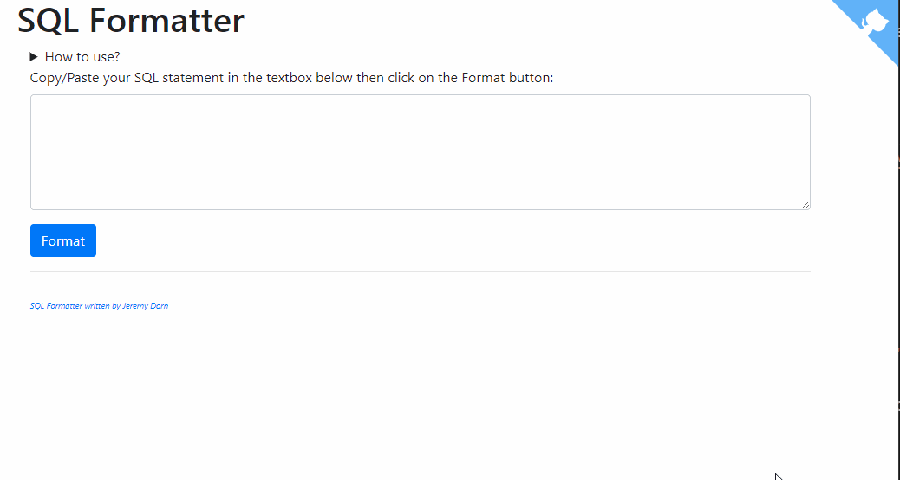

# SQL Formatter


Very straight-forward script for formatting SQL statement.

Format string like, f.i.,

```sql
SELECT LAT_N, CITY, TEMP_F FROM STATS, STATION WHERE MONTH = 7 AND STATS.ID = STATION.ID ORDER BY TEMP_F
```

into

```sql
SELECT
    LAT_N,
    CITY,
    TEMP_F
FROM
    STATS,
    STATION
WHERE
    MONTH = 7
    AND STATS.ID = STATION.ID
ORDER BY
    TEMP_F
```

## How to use

Just copy/paste your SQL statement into the text box as illustrated here below and click on the `Format` button.



## Source

The `SqlFormatter` has been written by `Jeremy Dorn` and available on GitHub: https://github.com/jdorn/sql-formatter.
